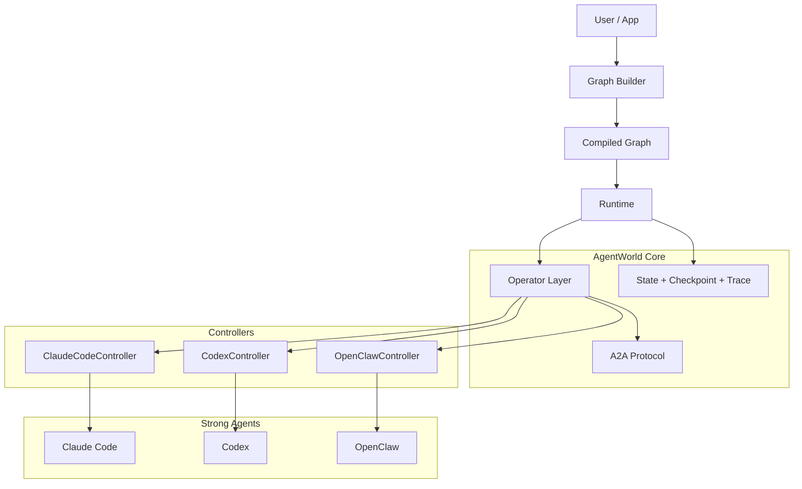

# AgentWorld

[](https://black-yt.github.io/AgentWorld/)
[](https://github.com/black-yt/AgentWorld/actions/workflows/ci.yml)
[](https://www.python.org/)
[](https://github.com/black-yt/AgentWorld)

**Graph-native orchestration for strong agents.**  
[Quick Start](#-quick-start) | [Why AgentWorld](#-why-agentworld) | [Architecture](#-architecture) | [Examples](#-examples) | [Roadmap](#-roadmap) | [Design Doc](docs/architecture.md)

<p>
  
</p>

AgentWorld is a runtime for coordinating strong agents such as Claude Code, Codex, and future operator-style systems inside one programmable graph.

Instead of wrapping another LLM SDK, AgentWorld separates provider control, operator execution, agent-to-agent messaging, state merging, checkpoints, traces, and routing into a cleaner systems layer for multi-agent execution.

## Overview

### Highlights

| Capability | Current State |
| --- | --- |
| Strong-agent-first graph runtime | Implemented |
| Reducer-based shared state merging | Implemented |
| Typed A2A envelopes and artifact flow | Implemented |
| `DefaultOperator` execution path | Implemented |
| Real `ClaudeCodeController` integration | Implemented and smoke-tested |
| `CodexController` contract | Scaffolded |
| `OpenClawController` contract | Scaffolded |
| CI on Python 3.11 / 3.12 | Active |

### Why AgentWorld

Most older agent frameworks were designed around prompt loops, tool loops, and model calls.

AgentWorld starts from a different assumption: the execution worker is already a capable agent with:

- tools
- sessions
- filesystem access
- long-running behavior
- provider-specific execution rules

That changes the core design problem:

- provider complexity should stop at the controller boundary
- graph nodes should invoke operators, not raw model calls
- agent-to-agent traffic should be explicit and typed
- runtime state should be mergeable and replayable
- checkpoint, resume, interrupt, and trace should be built in

## Architecture



### Execution Model

1. Build a graph of operator-backed nodes
2. Compile the graph into a runtime
3. Assemble a normalized operator request
4. Let a controller drive the real agent
5. Convert events into messages, artifacts, and state patches
6. Merge state, route the next nodes, and persist checkpoints

### Core Boundaries

| Boundary | Responsibility |
| --- | --- |
| Controller | Provider-specific invocation, sessions, event parsing, tool policy mapping |
| Operator | Uniform request/result contract, context assembly, normalized outputs |
| A2A Protocol | Messages, handoffs, tool outputs, artifact references |
| Runtime | Scheduling, state merge, checkpoint, resume, interrupt, trace |

## Quick Start

### 1. Install

```bash
python -m pip install -e .
```

### 2. Run tests

```bash
python -m unittest discover -s tests -v
```

### 3. Run the in-memory graph example

```bash
python examples/planner_coder_reviewer.py
```

### 4. Run the real Claude Code smoke case

```bash
python examples/claude_real_smoke.py
```

The Claude smoke case requires a working local `claude` CLI and an authenticated environment.

## Examples

### Planner -> Coder -> Reviewer

[examples/planner_coder_reviewer.py](examples/planner_coder_reviewer.py)

An in-memory example that validates:

- sequential graph execution
- reducer-based state merging
- artifact creation
- message propagation across nodes

### Real Claude Code Graph

[examples/claude_real_smoke.py](examples/claude_real_smoke.py)

A real controller-backed flow that validates:

- `ClaudeCodeController` command assembly
- real event parsing from Claude Code
- `tool_call` and `tool_result` normalization
- graph handoff from planner to reviewer

## Repository Layout

```text
.
├── README.md
├── docs/
│   ├── index.html
│   ├── architecture.md
│   └── assets/
├── examples/
├── src/agentworld/
│   ├── controller/
│   ├── graph/
│   ├── operator/
│   ├── protocol/
│   └── runtime/
└── tests/
```

## Documentation

- Project site: [black-yt.github.io/AgentWorld](https://black-yt.github.io/AgentWorld/)
- Detailed architecture note: [docs/architecture.md](docs/architecture.md)
- GitHub Pages source: [docs/index.html](docs/index.html)

## Current Status

### Implemented

- graph builder and compiled runtime
- operator models and normalized execution flow
- A2A envelope and artifact primitives
- reducer-based shared state merging
- real Claude Code controller path
- CI with unit tests

### In Progress

- richer graph commands
- better checkpoint and resume semantics
- stronger runtime trace and artifact indexing

### Planned

- Codex runtime controller
- OpenClaw runtime controller
- more real-agent end-to-end examples
- more explicit human-in-the-loop interruption points

## Roadmap

- finish provider-specific controllers beyond Claude Code
- harden resumability and failure recovery
- extend graph routing and handoff semantics
- improve trace persistence and debugging surfaces
- add more production-like examples and docs

## Contributing

This repository is still early-stage, but the public surface is now stable enough for contribution around:

- controller implementations
- runtime behavior
- graph semantics
- tests and examples
- documentation improvements

## Summary

AgentWorld is building a runtime layer for the era after simple LLM wrappers. The project already has a real graph core, normalized operator flow, CI, and a working Claude Code integration path. The next step is to make that foundation durable enough for serious multi-agent execution.
