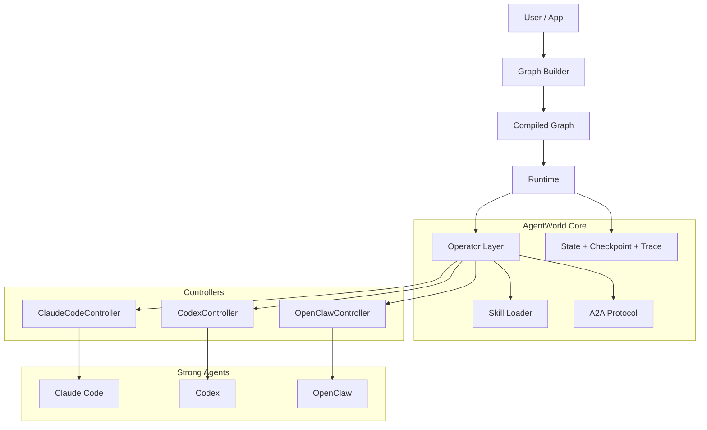

<a id="top"></a>

<div align="center">
  <h1>AgentWorld</h1>
</div>

<div align="center">

[](https://black-yt.github.io/AgentWorld/)
[](https://github.com/black-yt/AgentWorld)
[](https://github.com/black-yt/AgentWorld/actions/workflows/ci.yml)
[](https://www.python.org/)
[](#-skill-marketplace)
[](#-supported-operators)
[](https://github.com/black-yt/AgentWorld)

**Orchestrating strong agents from controller-level execution to graph-level collaboration**

[Quick Start](#-quick-start) | [Skill Marketplace](#-skill-marketplace) | [How It Works](#%EF%B8%8F-how-it-works) | [Supported Operators](#-supported-operators) | [Examples](#-examples) | [Roadmap](#-roadmap)

</div>

<p align="center">
  
</p>

---

AgentWorld is a graph runtime for multi-agent systems where the execution primitive is a **strong agent** such as Claude Code, Codex, or OpenClaw, rather than a single model call.

Instead of wrapping another LLM SDK, AgentWorld separates:

- provider-specific control into **controllers**
- upper-layer execution into **operators**
- inter-agent communication into an explicit **A2A protocol**
- scheduling, checkpointing, and replay into a **graph runtime**
- reusable domain expertise into a **skill marketplace**

## Overview

### ✨ Highlights

<table>
<tr>
<td align="center" width="25%">🧠<br/><b>Strong-Agent Runtime</b><br/><sub>Designed for Claude Code, Codex, OpenClaw, and other long-running operator-style agents</sub></td>
<td align="center" width="25%">🕸️<br/><b>Graph-Native Execution</b><br/><sub>Nodes schedule operators, merge shared state, route handoffs, and coordinate recovery</sub></td>
<td align="center" width="25%">🧩<br/><b>Per-Node Skills</b><br/><sub>Each operator node can load different skills for paper search, synthesis, experiment planning, and review</sub></td>
<td align="center" width="25%">📦<br/><b>Recoverable Runs</b><br/><sub>Built around checkpoints, traceability, artifacts, and resumable execution semantics</sub></td>
</tr>
<tr>
<td align="center">🔌<br/><b>Controller Boundary</b><br/><sub>Provider-specific session lifecycle, tool policy, and stream parsing stay isolated</sub></td>
<td align="center">📨<br/><b>Explicit A2A</b><br/><sub>Messages, tool results, handoffs, and artifacts are structured instead of prompt glue</sub></td>
<td align="center">🧪<br/><b>Real Smoke Path</b><br/><sub>Claude Code already runs through the runtime in a real graph-backed case</sub></td>
<td align="center">⚙️<br/><b>Lightweight Core</b><br/><sub>Pure Python package with CI, tests, and no heavy orchestration framework dependency</sub></td>
</tr>
</table>

### 💡 Why AgentWorld

Most older agent frameworks evaluate what a model can call.

AgentWorld is built around what a strong agent can **run**:

- a real session
- a working directory
- a permission model
- tool calls with side effects
- long-running stateful execution
- collaboration with other agents in the same graph

That changes the architecture:

- a node is not just a prompt or function
- a controller is not optional glue, it is the provider boundary
- a skill is not a marketing label, it is reusable execution guidance attached to an operator
- a runtime must own checkpoint, resume, interrupt, trace, and artifact flow

### 🆕 News

- **2026-04-13** Added a dedicated `skills/` marketplace with research-oriented skills for paper search, literature synthesis, citation audit, experiment planning, and result audit.
- **2026-04-13** Added explicit per-node `skills` support so each operator node can receive a different skill set through the runtime.
- **2026-04-13** Published the GitHub Pages site under `docs/` and split the long architecture note into a dedicated design document.
- **2026-04-13** Refined the public repository surface so README and site stay English-first while private notes remain local and ignored.

## 🚀 Quick Start

Install the package:

```bash
python -m pip install -e .
```

Run the test suite:

```bash
python -m unittest discover -s tests -v
```

Run the in-memory planner / coder / reviewer graph:

```bash
python examples/planner_coder_reviewer.py
```

Run the real Claude Code smoke graph:

```bash
python examples/claude_real_smoke.py
```

The Claude smoke case requires a working local `claude` CLI and an authenticated environment.

## ⚙️ How It Works



### Core Execution Flow

1. Build a graph of operator-backed nodes
2. Assign objective, role, tool policy, and skills to each node
3. Compile the graph into a runtime
4. Let the runtime assemble a normalized operator request
5. Let the controller drive the real strong agent
6. Convert events into messages, artifacts, handoffs, and state patches
7. Merge state, route the next nodes, and persist traceable execution state

### Core Boundaries

| Boundary | Responsibility |
| --- | --- |
| Controller | provider-specific invocation, sessions, stream parsing, tool policy mapping |
| Operator | uniform request/result contract, prompt assembly, skill loading, normalized outputs |
| Skill | reusable domain guidance, references, scripts, and task-specific workflow instructions |
| A2A Protocol | messages, tool outputs, handoffs, artifact references |
| Runtime | scheduling, state merge, checkpoint, resume, interrupt, trace |

## 🧩 Skill Marketplace

AgentWorld treats skills as reusable execution modules that can be attached to individual operator nodes.

A skill is stored as a folder, usually with:

- `SKILL.md` for instructions and activation guidance
- optional `references/` for domain notes
- optional `scripts/` for repeatable local tooling
- optional `assets/` for templates or helper files

### Included Research Skills

| Skill | Purpose |
| --- | --- |
| `research-paper-search` | find papers, databases, identifiers, and evidence trails before execution |
| `literature-synthesis` | turn a paper set into claims, themes, contradictions, and gaps |
| `citation-audit` | validate references, metadata, citation hygiene, and bibliography consistency |
| `experiment-planning` | design executable research plans, deliverables, risks, and validation steps |
| `result-audit` | review outputs for unsupported claims, missing evidence, weak baselines, and incomplete analysis |

### Load Different Skills Per Operator

```python
from agentworld import AgentGraph, DefaultOperator

graph = AgentGraph(name="research-flow")
graph.add_operator("planner", planner_operator)
graph.add_operator("reviewer", reviewer_operator)

graph.add_node(
    "plan",
    operator="planner",
    objective="Search relevant work and plan the study",
    skills=["research-paper-search", "literature-synthesis", "experiment-planning"],
)

graph.add_node(
    "review",
    operator="reviewer",
    objective="Audit claims and evidence",
    skills=["citation-audit", "result-audit"],
)
```

The runtime injects the selected skill list into the operator request, so different nodes can run with different domain guidance even when they use the same underlying controller.

### Add Your Own Skill

Create a new folder under `skills/`:

```text
skills/
└── my-skill/
    └── SKILL.md
```

Minimal `SKILL.md` format:

```md
---
name: my-skill
description: What this skill should be used for.
---

# My Skill

## When to Use This Skill
- ...

## Workflow
- ...
```

## 🤖 Supported Operators

AgentWorld is designed to schedule strong agents through provider-specific controllers:

| Operator | Current State | Notes |
| --- | --- | --- |
| **Claude Code** | Implemented | Real CLI-backed controller with stream parsing and smoke coverage |
| **Codex** | Scaffolded | Contract is present, runtime path still needs full implementation |
| **OpenClaw** | Scaffolded | Contract is present, controller behavior still needs full implementation |

## 🧪 Examples

### Planner -> Coder -> Reviewer

[examples/planner_coder_reviewer.py](examples/planner_coder_reviewer.py)

Validates:

- sequential graph execution
- reducer-based state merging
- artifact creation
- message propagation
- per-node skill injection

### Real Claude Code Graph

[examples/claude_real_smoke.py](examples/claude_real_smoke.py)

Validates:

- real `ClaudeCodeController` command assembly
- real event parsing from Claude Code
- `tool_call` and `tool_result` normalization
- planner-to-reviewer graph handoff

## 📁 Repository Structure

```text
.
├── README.md
├── docs/
│   ├── index.html
│   ├── architecture.md
│   └── assets/
├── examples/
├── skills/
│   ├── README.md
│   ├── research-paper-search/
│   ├── literature-synthesis/
│   ├── citation-audit/
│   ├── experiment-planning/
│   └── result-audit/
├── src/agentworld/
│   ├── controller/
│   ├── graph/
│   ├── operator/
│   ├── protocol/
│   └── runtime/
└── tests/
```

## 📚 Documentation

- Official site: [black-yt.github.io/AgentWorld](https://black-yt.github.io/AgentWorld/)
- Architecture note: [docs/architecture.md](docs/architecture.md)
- Skill marketplace: [skills/README.md](skills/README.md)

## 🗺️ Roadmap

- complete the Codex controller
- complete the OpenClaw controller
- harden checkpoint, resume, and trace persistence
- extend graph routing and handoff semantics
- grow the skill marketplace with stronger scientific and engineering skills
- add more real-agent end-to-end examples

---

## Community

### 🤝 Contributing

Contributions are especially useful around:

- controller implementations
- runtime behavior
- graph semantics
- skill design
- tests and examples
- documentation improvements

### 📬 Contact

Open an issue for bugs, design questions, controller support requests, or skill contributions.

### ⭐ Star History

<a href="https://www.star-history.com/#black-yt/AgentWorld&Date">
  <picture>
    <source media="(prefers-color-scheme: dark)" srcset="https://api.star-history.com/svg?repos=black-yt/AgentWorld&type=Date&theme=dark" />
    <source media="(prefers-color-scheme: light)" srcset="https://api.star-history.com/svg?repos=black-yt/AgentWorld&type=Date" />
    
  </picture>
</a>

<p align="right"><a href="#top">🔝 Back to top</a></p>
