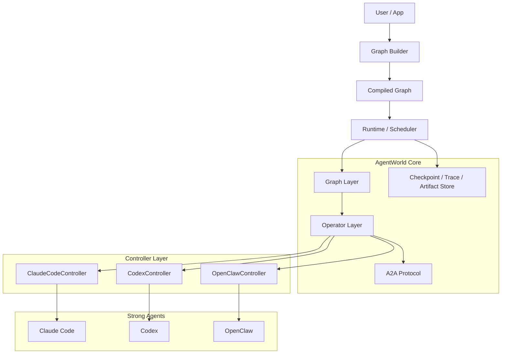
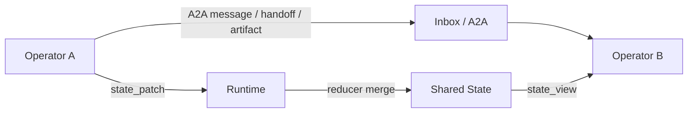
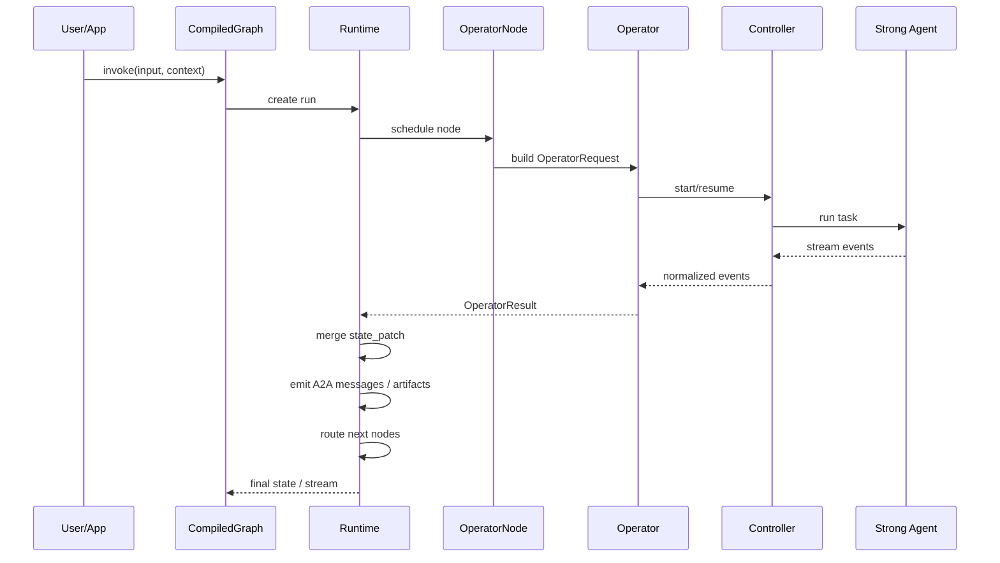

# AgentWorld

> A general-purpose multi-agent orchestration framework for strong agents.
> At the current stage, the priority is to define abstractions, boundaries, and the execution model, not to pile on implementation detail.

## 1. What This Is

AgentWorld is not another agent framework in the older sense of "wrapping an LLM SDK with prompts and tools."

It is aimed at a different problem:

- The execution primitive is no longer a single LLM API call
- The execution primitive is a strong agent such as `Claude Code`, `Codex`, or `OpenClaw`, with tool use, sessions, filesystem access, and long-running execution
- The framework itself does not think on behalf of those agents; instead, it is responsible for:
  - controlling them through a uniform upper-layer interface
  - scheduling them
  - organizing collaboration between them
  - maintaining shared multi-agent state
  - letting them run reliably inside a graph-based workflow

In one sentence, this framework is an operating layer / orchestration layer for strong agents, not an LLM invocation wrapper.

## 2. How It Differs from the Previous Generation of Agent Frameworks

### Core objects in the previous generation

The previous generation of frameworks usually centered around:

- LLM
- Prompt
- Tool
- Memory
- Chain / AgentExecutor

Those frameworks typically assumed:

- the agent itself is fundamentally a model-call loop
- tool calls are just part of model output
- session state is primarily managed by the framework itself

### Core objects in this generation

In this generation, the core objects should become:

- `Controller`: how to actually control a specific strong agent
- `Operator`: the execution unit that exposes a uniform behavior to upper layers
- `A2A Protocol`: how agents exchange messages, tool results, artifacts, and control signals
- `Graph`: the collaboration graph across multiple agents
- `Runtime`: scheduling, state merging, checkpoint, resume, interrupt, and trace

That means the smallest meaningful unit is no longer "a model call", but "a durable agent operator".

## 3. Design Goals

The goals of this repository are straightforward:

1. Define one unified operator interface for strong agents
2. Push provider-specific control detail down into each controller
3. Provide LangGraph-like graph orchestration where nodes are strong-agent operators
4. Define an internal A2A protocol so agent communication is not just arbitrary text concatenation
5. Make runs recoverable, traceable, interruptible, and replayable

## 4. Non-Goals

At this stage, the framework is explicitly not trying to do the following:

- reimplement the intelligence inside Claude Code / Codex / OpenClaw
- force every agent into one prompt template
- start with a full platform UI
- support every provider and every runtime environment from day one
- turn the framework into a giant all-in-one system

Phase one only targets the minimum critical loop:
`unified control -> graph scheduling -> state management -> multi-agent collaboration -> recoverable execution`

## 5. Design Principles

### 5.1 Strong-agent first

The framework assumes the lower layer is already a strong agent, not a bare model interface.

### 5.2 Concrete control belongs in the controller

Different strong agents vary dramatically, for example:

- session creation differs
- session recovery differs
- tool permission configuration differs
- streaming output format differs
- filesystem and workspace constraints differ

Those differences should not leak into the graph layer. The controller should absorb them.

### 5.3 The upper-layer interface stays unified

To the graph and runtime, it should not matter whether the underlying provider is Claude Code or Codex.
The graph only needs to know:

- which operator this node invokes
- what input the operator requires
- what normalized result it returns
- how state and routing should be updated afterward

### 5.4 State is explicit, messages are explicit

Shared state and agent-to-agent messages are different things and must be designed separately:

- `State`: graph-level authoritative state
- `A2A Message`: the communication carrier between agents

The system should not rely on plain natural-language context stitching, and it should not stuff everything into global state.

### 5.5 Builder and runtime stay separate

One of LangGraph's best ideas is:

- graph construction only describes structure
- execution happens in a compiled runtime

That separation is what enables:

- validation
- visualization
- checkpoint
- resume
- interrupt
- tracing

## 6. Overall Architecture



## 7. Five Core Layers of Abstraction

### 7.1 Controller Layer

This layer solves exactly one problem: `how to drive a specific strong agent in the real world`.

It is provider-specific.

For example:

- `ClaudeCodeController` needs to know how to create sessions, resume them, configure tool permissions, and parse `stream-json`
- `CodexController` needs to know how to start tasks, consume events, and handle workspace changes
- `OpenClawController` needs to know its own API / CLI / runtime constraints

This layer should expose normalized events upward, not leak provider-specific calling detail.

### What the controller must handle

- session creation and recovery
- execution parameter assembly
- workspace binding
- output stream parsing
- tool permission mapping
- timeout / failure / interrupt handling
- raw trace preservation

### What the controller should not handle

- graph routing
- multi-agent collaboration strategy
- shared-state merging
- business workflow orchestration

### 7.2 Operator Layer

This is the center of execution abstraction in the framework.

An `Operator` does not mean "a model". It means:

> a strong-agent execution unit that can be scheduled by the graph, perform work, emit normalized outputs, and be resumed.

The graph layer only knows operators, not controllers.

### Operator responsibilities

- accept normalized input
- assemble prompt / context / inbox / artifacts / working directory
- invoke the underlying controller
- normalize lower-layer events
- emit normalized results

### Minimal operator interface

```python
class Operator(Protocol):
    def invoke(self, request: "OperatorRequest", runtime: "RuntimeContext") -> "OperatorResult":
        ...

    def resume(self, request: "OperatorResumeRequest", runtime: "RuntimeContext") -> "OperatorResult":
        ...
```

### Suggested `OperatorRequest` fields

| Field | Meaning |
| --- | --- |
| `operator_id` | current operator identifier |
| `role` | role such as planner / coder / reviewer |
| `objective` | the node objective for this execution |
| `state_view` | the state slice visible to this node |
| `inbox` | incoming A2A messages |
| `artifacts` | visible artifacts |
| `working_dir` | working directory |
| `session_policy` | whether to create a new session, reuse one, or force resume |
| `tool_policy` | allowed tools and permission level |
| `timeout_s` | timeout in seconds |
| `metadata` | additional runtime metadata |

### Suggested `OperatorResult` fields

| Field | Meaning |
| --- | --- |
| `status` | `success / failed / interrupted / timeout` |
| `session_ref` | native session handle for the lower-layer agent |
| `messages` | normalized A2A output messages |
| `state_patch` | incremental graph-state update |
| `artifacts` | produced files, patches, reports, etc. |
| `handoffs` | explicit work handoffs to other operators |
| `metrics` | tokens, duration, tool-call count, etc. |
| `trace_ref` | reference to raw logs / streaming output |
| `error` | normalized error object |

### 7.3 A2A Protocol Layer

This is the layer where the project can most clearly separate itself from a generic workflow framework.

Without an A2A protocol, multi-agent collaboration eventually collapses into:

- prompt concatenation everywhere
- arbitrary text passing everywhere
- no message filtering, routing, auditing, or replay

So this layer must define a real internal protocol.

### Goals of the A2A protocol

- make agent-to-agent interaction structured
- make messages and artifacts traceable
- let the graph runtime understand what an output actually means
- make replay / evaluation / debugging possible later

### Minimal protocol objects

#### 1. Message

Represents tasks, observations, conclusions, plans, review comments, and other textual or structured content.

#### 2. ToolCall

Represents a tool call made by an agent.

#### 3. ToolResult

Represents the result returned by a tool call.

#### 4. Artifact

Represents files, patches, reports, code snippets, charts, and other outputs produced by an agent.

#### 5. Handoff

Represents what task is handed off to which downstream agent.

### Suggested `A2AEnvelope` shape

```python
class A2AEnvelope(TypedDict):
    id: str
    thread_id: str
    sender: str
    receiver: str | None
    kind: str
    payload: dict
    artifacts: list[dict]
    reply_to: str | None
    created_at: str
```

### Recommended message kinds

- `task`
- `plan`
- `observation`
- `decision`
- `review`
- `tool_call`
- `tool_result`
- `artifact`
- `handoff`
- `error`
- `final`

### 7.4 Graph Layer

The graph layer should borrow the right core ideas from LangGraph, but upgrade node semantics.

LangGraph's key insights are sound:

- use an explicit graph to describe workflows
- let nodes read and write shared state
- support `add_node / add_edge / add_conditional_edges / compile`
- execute through a compiled runtime

But in AgentWorld, nodes cannot be only generic function nodes. They must also support strong-agent nodes.

### Minimum node types the graph should support

| Node Type | Purpose |
| --- | --- |
| `operator node` | invoke a strong-agent operator |
| `router node` | decide the next hop from state or messages |
| `reducer node` | merge parallel outputs |
| `tool node` | execute pure tool logic |
| `human node` | human approval / intervention |

### Edge types the graph should support

| Edge Type | Purpose |
| --- | --- |
| `direct edge` | fixed-order execution |
| `conditional edge` | branch by condition |
| `fan-out` | one-to-many dispatch |
| `join edge` | wait for multiple predecessors |
| `dynamic send` | runtime delivery to selected nodes |

### Suggested graph builder interface

```python
graph = AgentGraph(state_schema=State, context_schema=Context)
graph.add_operator("planner", planner_operator)
graph.add_operator("coder", coder_operator)
graph.add_node("plan", operator="planner")
graph.add_node("implement", operator="coder")
graph.add_edge("plan", "implement")
graph.add_conditional_edges("implement", route_fn)
compiled = graph.compile()
```

### State design principles

Graph state should be strongly typed, partially updatable, and mergeable.

The LangGraph-style reducer idea is worth keeping:

- each state field can define its own merge rule
- when parallel nodes write to the same field, the reducer is responsible for convergence

### Common reducers

| Field Type | Recommended Reducer |
| --- | --- |
| `messages: list` | append |
| `artifacts: list` | append |
| `metadata: dict` | merge |
| `final_answer` | last_value |
| `scores` | max / merge |

### 7.5 Runtime Layer

The runtime is the execution layer after graph compilation.

It is responsible for:

- node scheduling
- execution queue management
- state merging
- checkpoint
- resume
- interrupt
- retry
- timeout
- event stream
- tracing

This layer determines whether the framework is actually usable.

## 8. The Three Boundaries That Matter Most

If these boundaries are not clean, the implementation will become messy very quickly.

### 8.1 The boundary between controller and operator

#### The controller owns

- provider-specific invocation
- session lifecycle
- raw event parsing
- provider-specific parameters

#### The operator owns

- the upper-layer uniform request / uniform result contract
- prompt and context assembly
- integration with the graph runtime
- converting controller events into A2A outputs and `state_patch`

### 8.2 The boundary between A2A and state

#### A2A owns

- communication between agents
- task handoff
- process-level observations
- tool and artifact messages

#### State owns

- graph-level authoritative state
- structured data consumed by routing and reducers
- the runtime semantics that are truly persisted in checkpoints

In practice:

- put "chat-like content" into A2A
- put "workflow progress, conclusions, and aggregated results" into state



### 8.3 The boundary between builder and runtime

#### The builder owns

- structural declaration
- structural validation
- declaration of nodes, edges, and schema

#### The runtime owns

- actual execution
- run / thread / session management
- checkpoint persistence
- interrupt / resume handling

## 9. Execution Model

Below is the recommended unified execution model.

### 9.1 Core objects

| Object | Meaning |
| --- | --- |
| `graph_id` | graph definition identifier |
| `run_id` | one complete execution |
| `thread_id` | the same task thread, used for resume |
| `node_run_id` | one execution of one node |
| `operator_session_id` | the native session of the lower-layer strong agent |

### 9.2 Execution flow



### 9.3 Standard lifecycle of one node execution

1. The runtime selects executable nodes from the graph structure
2. The node reads its visible `state_view` from global state
3. The operator assembles the request
4. The controller invokes the underlying strong agent
5. Lower-layer output is normalized into `ControllerEvent`
6. The operator emits `messages + state_patch + artifacts + handoffs`
7. The runtime merges state through reducers
8. A router determines the next hop
9. The runtime writes checkpoint and trace

## 10. Controller Design Recommendations

This part must stay concrete, because it is where many projects sound abstractly correct and then fail in implementation.

### 10.1 Minimal controller interface

```python
class AgentController(Protocol):
    def start(self, request: "ControllerStartRequest") -> "ControllerRunHandle":
        ...

    def resume(self, request: "ControllerResumeRequest") -> "ControllerRunHandle":
        ...

    def stream(self, handle: "ControllerRunHandle") -> Iterator["ControllerEvent"]:
        ...

    def interrupt(self, session_id: str) -> None:
        ...
```

### 10.2 Required fields for `ControllerStartRequest`

| Field | Meaning |
| --- | --- |
| `session_id` | framework-assigned or framework-mapped session id |
| `working_dir` | current working directory |
| `instruction` | primary instruction |
| `attachments` | extra context and file references |
| `tool_policy` | tool permission policy |
| `env` | environment variables |
| `timeout_s` | timeout control |

### 10.3 `ControllerEvent` must be normalized

No matter what format the lower-layer agent emits, upper layers should eventually see only a small set of normalized event types:

- `session_started`
- `message_delta`
- `message_completed`
- `tool_call`
- `tool_result`
- `artifact_created`
- `state_hint`
- `heartbeat`
- `completed`
- `failed`

### 10.4 What should be absorbed from AutoR

From `AutoR`'s `operator.py`, the truly valuable part is not the word "operator", but the fact that it has already worked through real strong-agent runtime problems:

- prompt cache
- attempt counting
- `session_id` management
- resume and fallback start
- raw log persistence
- output file checking
- repair flows

Those concerns should be preserved in AgentWorld's controller and runtime design.

In other words, AgentWorld cannot stop at a clean abstraction. From day one it must also think about:

- what happens when a session breaks
- what happens when resume fails
- how logs are stored
- what happens when results are incomplete
- how one node retries

## 11. A2A Protocol Design Recommendations

### 11.1 Why A2A must exist as a separate layer

The output of a strong agent is no longer "just a text response". It may contain several things at once:

- a plan
- intermediate conclusions
- tool calls
- file modifications
- patches
- tasks that need to be handed to someone else

Without a protocol layer, all of that collapses into one blob of text, and the graph runtime cannot tell how to consume it.

### 11.2 The difference between A2A and handoff

- a `message` is communication
- a `handoff` is work transfer

A reviewer may send a review message without handing anything off.
A planner may hand off "implement module X" to a coder.

### 11.3 The minimum A2A closed loop

The first version does not need a huge protocol. It only needs to guarantee this closed loop:

1. one node can send a structured message to another node
2. one node can attach artifacts
3. the runtime can record message lineage
4. downstream nodes can make decisions from their inbox

## 12. Graph Design Recommendations

This layer should stay as simple as LangGraph where possible, while becoming more natural for strong agents.

### 12.1 LangGraph ideas worth preserving

- `state_schema`
- `context_schema`
- `add_node`
- `add_edge`
- `add_conditional_edges`
- `compile`
- reducers
- checkpoint / interrupt / stream

### 12.2 What needs to be upgraded

LangGraph nodes are function-like by default.

In AgentWorld, nodes need native support for:

- long-running execution
- external sessions
- artifacts
- agent-to-agent handoff
- workspace side effects

So node output should not be limited to a single dict patch. It should also be able to return control commands.

### 12.3 Suggested `GraphCommand`

```python
class GraphCommand(TypedDict, total=False):
    update: dict
    goto: str | list[str]
    send: list[A2AEnvelope]
    interrupt: bool
    finish: bool
```

This borrows the idea behind LangGraph's `Command / Send`, but adapts it to a more multi-agent-oriented semantic model.

## 13. Runtime Design Recommendations

### 13.1 Checkpoint support is mandatory

Strong-agent execution is not a single API call. It naturally encounters:

- interrupts
- timeouts
- retry after failure
- user intervention
- long-running task recovery

So the runtime must support checkpoints.

### 13.2 Resume support is mandatory

Resume exists on two different layers:

1. `graph-level resume`: recover the graph run
2. `operator-level resume`: recover the lower-layer agent session

Those two layers must not be conflated.

### 13.3 Interrupt support is mandatory

Interrupt is needed for:

- human approval
- pausing before high-risk operations
- waiting for external input when node output quality is not good enough

### 13.4 Trace support is mandatory

At minimum, there should be two trace layers:

- `raw trace`: raw output from the lower-layer agent
- `normalized trace`: the framework's normalized event stream

That is the only way debugging can answer:

- did the controller parse the event incorrectly?
- did the agent itself fail to produce the right result?
- or did the graph route incorrectly?

## 14. Minimal V1 Scope

To keep the design document from exploding before the system exists, the first version should only include the following.

### 14.1 V1 required

- one `AgentController` base contract
- `ClaudeCodeController`
- `CodexController`
- one unified `Operator`
- one minimal A2A protocol
- one `AgentGraph`
- `add_node / add_edge / add_conditional_edges / compile`
- `invoke / stream / resume`
- state reducers
- checkpoint / trace / artifact index

### 14.2 V1 optional

- `OpenClawController`
- human node
- retry policy
- cache policy
- multiple stream modes

### 14.3 V1 excluded

- a giant skill platform
- a frontend UI
- distributed scheduling
- token economics or market mechanisms
- a complex permission system

## 15. Recommended First Built-in Patterns

Once the core runtime is working, it makes sense to add a few simple but representative built-in patterns first:

### 15.1 Planner -> Coder -> Reviewer

The most basic three-stage collaboration pattern.

### 15.2 Planner -> Parallel Workers -> Reducer

This validates fan-out / join / reducer behavior.

### 15.3 Researcher -> Critic -> Writer

This validates A2A message passing and artifact handoff behavior.

## 16. Suggested Repository Structure

```text
.
├── README.md
├── docs/
│   ├── index.html
│   ├── assets/
│   │   ├── site.css
│   │   ├── site.js
│   │   └── ...
│   ├── architecture.md
│   ├── protocol_a2a.md
│   ├── controller_contract.md
│   └── graph_runtime.md
├── src/
│   └── agentworld/
│       ├── controller/
│       │   ├── base.py
│       │   ├── claude_code.py
│       │   ├── codex.py
│       │   └── openclaw.py
│       ├── operator/
│       │   ├── base.py
│       │   ├── models.py
│       │   └── default.py
│       ├── protocol/
│       │   ├── a2a.py
│       │   └── artifacts.py
│       ├── graph/
│       │   ├── builder.py
│       │   ├── compiled.py
│       │   ├── node.py
│       │   ├── edge.py
│       │   └── reducers.py
│       ├── runtime/
│       │   ├── scheduler.py
│       │   ├── executor.py
│       │   ├── checkpoint.py
│       │   ├── events.py
│       │   └── tracing.py
│       └── storage/
│           ├── artifacts.py
│           └── sessions.py
└── examples/
    ├── planner_coder_reviewer.py
    └── parallel_workers.py
```

## 17. What Should Be Written First Right Now

At the current stage, the priority is not to build many patterns. The priority is to define these five files correctly:

1. `controller/base.py`
2. `operator/models.py`
3. `protocol/a2a.py`
4. `graph/builder.py`
5. `runtime/executor.py`

Those five files will largely determine whether the architecture stays stable later.

## 18. Design References

This design clearly draws from two existing lines of work, but it should not copy either of them mechanically.

### Inspiration from AutoR

- "operator" must correspond to real execution control, not just a name
- session / attempt / resume / fallback / logs / repair must all be first-class concerns

### Inspiration from LangGraph

- graph construction and runtime execution are separate
- explicit state schema
- reducers
- conditional edges
- compile before execution
- checkpoint / interrupt / stream

## 19. One-Sentence Summary

AgentWorld should not "wrap another LLM agent". It should define a unified control interface, A2A protocol, graph orchestration model, and recoverable runtime for strong agents such as `Claude Code`, `Codex`, and `OpenClaw`, so that multi-agent systems become real infrastructure that can be built, scheduled, and traced.
