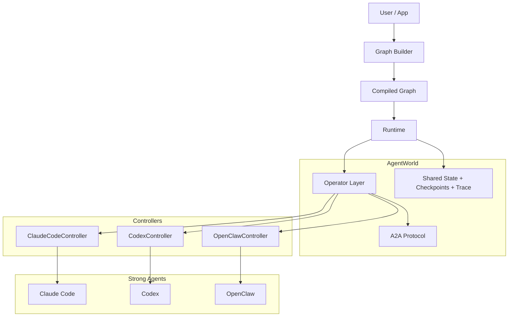

# AgentWorld

[](https://github.com/black-yt/AgentWorld/actions/workflows/ci.yml)


AgentWorld is a graph runtime for orchestrating strong agents such as Claude Code, Codex, and future operator-style systems.

It separates provider-specific control from graph orchestration, shared state, agent-to-agent messaging, and recoverable execution. The goal is not to wrap another LLM SDK. The goal is to treat strong agents as the execution primitive and make multi-agent systems programmable infrastructure.


## Why AgentWorld

Most earlier agent frameworks were built around prompts, model calls, and tool loops. AgentWorld is built around a different assumption: the worker below the framework is already a capable agent with tools, sessions, filesystem access, and long-running behavior.

That shifts the hard problems:

- provider-specific control should live in a controller
- graph nodes should invoke operators, not raw model calls
- agent-to-agent traffic should be explicit and typed
- runtime state should be mergeable, replayable, and resumable
- checkpoints and traces should be core infrastructure, not afterthoughts

## What Exists Today

| Component | Status |
| --- | --- |
| `AgentGraph` builder and compiled runtime | Implemented |
| Reducer-based shared state merging | Implemented |
| A2A envelopes and artifact models | Implemented |
| `DefaultOperator` execution path | Implemented |
| `ClaudeCodeController` | Implemented and smoke-tested against the real CLI |
| `CodexController` | Contract scaffolded, implementation pending |
| `OpenClawController` | Contract scaffolded, implementation pending |
| CI on Python 3.11 / 3.12 | Active |

## Core Model



## Quick Start

Install the package in editable mode:

```bash
python -m pip install -e .
```

Run the test suite:

```bash
python -m unittest discover -s tests -v
```

Run the in-memory planner / coder / reviewer example:

```bash
python examples/planner_coder_reviewer.py
```

Run the real Claude Code smoke case:

```bash
python examples/claude_real_smoke.py
```

The Claude smoke case expects a working `claude` CLI installation and an authenticated local environment.

## Architecture Themes

### 1. Controllers absorb provider complexity

Session lifecycle, permission mapping, event parsing, working directory binding, and provider-specific execution should stop at the controller boundary.

### 2. Operators define one execution contract

The graph should schedule a uniform operator request and receive a uniform operator result, regardless of which strong agent is underneath.

### 3. A2A is separate from shared state

Messages, handoffs, tool outputs, and artifacts belong to the protocol layer. Reducer-friendly workflow state belongs to the runtime.

### 4. Runtime semantics matter

Long-running agents make checkpoint, resume, interrupt, retry, and trace first-class concerns.

## Repository Layout

```text
.
├── README.md
├── docs/
│   ├── index.html
│   ├── architecture.md
│   └── assets/
├── examples/
├── src/agentworld/
│   ├── controller/
│   ├── graph/
│   ├── operator/
│   ├── protocol/
│   └── runtime/
└── tests/
```

## Design and Docs

- Detailed architecture note: [docs/architecture.md](docs/architecture.md)
- GitHub Pages site source: [docs/index.html](docs/index.html)
- Real graph examples: [examples/planner_coder_reviewer.py](examples/planner_coder_reviewer.py) and [examples/claude_real_smoke.py](examples/claude_real_smoke.py)

## Development Conventions

- Public project files stay in English
- Private notes, meeting logs, scratch files, artifacts, and local working material are ignored by Git
- Provider-specific code should stay inside controllers
- Graph semantics should stay provider-agnostic

## Near-Term Roadmap

- finish the Codex controller
- finish the OpenClaw controller
- harden checkpoint and resume behavior
- extend graph commands for richer routing and handoff control
- add more end-to-end real-agent examples

## Summary

AgentWorld is an early-stage but real implementation of a strong-agent orchestration runtime. It already has a working graph layer, normalized operator flow, A2A primitives, CI, and a real Claude Code integration path. The next step is to turn that base into a cleaner, more durable execution layer for multi-agent systems.
