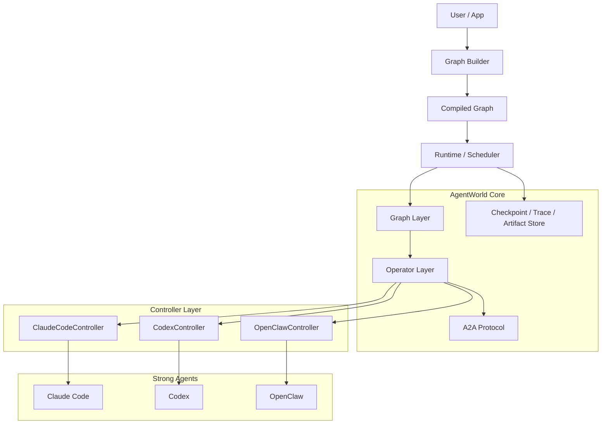
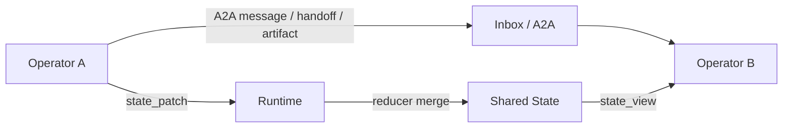
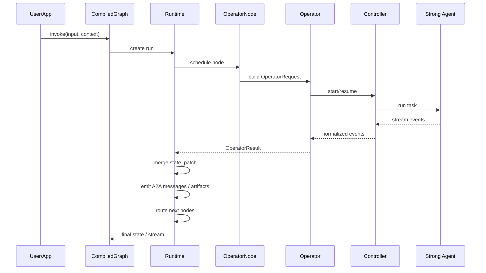

# AgentWorld

> 面向强 Agent 的通用多智能体编排框架设计稿。
> 当前阶段先定义抽象、边界和运行模型，不写实现细节，不做功能堆砌。

## 1. 这是什么

AgentWorld 不是上一代那种“对 LLM SDK 做 Prompt + Tool 封装”的 Agent Framework。

它要解决的是另一类问题：

- 底层执行单元不再是单个 LLM API 调用
- 底层执行单元是 `Claude Code`、`Codex`、`OpenClaw` 这类已经具备工具使用、会话、文件系统操作、长链路执行能力的强 Agent
- 框架本身不负责替这些 Agent 思考，而是负责：
  - 统一控制它们
  - 调度它们
  - 组织它们之间的协作
  - 维护多智能体共享状态
  - 让它们可以稳定地运行在一个图结构工作流里

一句话说，这个框架是一个“强 Agent 的操作系统层 / 编排层”，而不是“LLM 调用封装层”。

## 2. 与上一代 Agent Framework 的根本区别

### 上一代框架的核心对象

上一代框架的核心对象通常是：

- LLM
- Prompt
- Tool
- Memory
- Chain / AgentExecutor

它们默认假设：

- 一个 Agent 的主体就是一个模型调用循环
- Tool Call 是模型输出的一部分
- 会话状态主要由框架自己维护

### 这一代框架的核心对象

这一代框架的核心对象应该变成：

- `Controller`：如何具体控制某个强 Agent
- `Operator`：对上层暴露统一行为的执行单元
- `A2A Protocol`：Agent 与 Agent 之间如何交换消息、工具结果、产物与控制信号
- `Graph`：多智能体协作图
- `Runtime`：调度、状态合并、checkpoint、resume、interrupt、trace

也就是说，我们不再把“模型调用”当作最小单位，而是把“可持续运行的 Agent Operator”当作最小单位。

## 3. 设计目标

这个仓库的目标很明确：

1. 抽象出一套统一的强 Agent Operator 接口
2. 让不同 Agent 的控制细节收敛到各自的 Controller 中
3. 提供类似 LangGraph 的图编排能力，但图上的节点是强 Agent Operator
4. 提供一套内部 A2A 协议，让 Agent 间通信不再是随意拼接文本
5. 让运行具备可恢复、可追踪、可中断、可重放的能力

## 4. 非目标

当前阶段明确不做这些事情：

- 不重新实现 Claude Code / Codex / OpenClaw 内部的智能能力
- 不把所有 Agent 统一成同一种 Prompt 模板
- 不先做一整套平台产品界面
- 不一开始就支持所有 Provider 和所有运行环境
- 不把框架设计成一个巨大的全能系统

第一阶段只做最关键的最小闭环：`统一控制 -> 图调度 -> 状态管理 -> 多 Agent 协作 -> 可恢复运行`。

## 5. 设计原则

### 5.1 强 Agent 优先

框架默认“底层已经是强 Agent”，而不是“底层只是一个裸模型接口”。

### 5.2 具体控制下沉到 Controller

不同 Agent 的差异极大，例如：

- 会话创建方式不同
- 恢复会话的方式不同
- 工具权限配置不同
- 输出流格式不同
- 文件系统和工作区约束不同

这些差异不应该泄漏到 Graph 层，而应该由 Controller 兜住。

### 5.3 上层接口统一

对 Graph / Runtime 来说，不应该关心底层是 Claude Code 还是 Codex。  
它只关心：

- 这个节点调用哪个 Operator
- Operator 需要什么输入
- 返回什么标准化结果
- 接下来怎么更新状态和路由

### 5.4 显式状态，显式消息

共享状态和 Agent 间消息是两种不同的东西，必须分开设计：

- `State`：图级别的权威状态
- `A2A Message`：Agent 之间的通信载体

不能只靠自然语言拼接上下文，也不能把所有信息都塞进全局 state。

### 5.5 Builder / Runtime 分离

借鉴 LangGraph 的优点：

- 构图阶段只描述结构
- 运行阶段由编译后的 Runtime 执行

这样才能支持：

- 校验
- 可视化
- checkpoint
- resume
- interrupt
- tracing

## 6. 总体架构



## 7. 五层核心抽象

### 7.1 Controller Layer

这一层只解决一件事：`怎么真实地驱动某个具体 Agent`。

它是 Provider-specific 的。

例如：

- `ClaudeCodeController` 需要知道如何创建 session、如何 resume、如何设置工具权限、如何解析 stream-json
- `CodexController` 需要知道如何发起任务、如何接收事件、如何处理工作区变更
- `OpenClawController` 需要知道它自己的 API / CLI / runtime 约束

这一层只向上暴露统一事件，不向上暴露底层乱七八糟的调用细节。

### Controller 必须解决的事情

- 会话创建与恢复
- 运行参数组装
- 工作区绑定
- 输出流解析
- 工具权限映射
- 超时 / 失败 / 中断处理
- 原始 trace 保留

### Controller 不应该做的事情

- 不负责图路由
- 不负责多 Agent 协作策略
- 不负责共享状态合并
- 不负责业务工作流编排

### 7.2 Operator Layer

这一层是整个框架的执行抽象中心。

一个 `Operator` 的语义不是“一个模型”，而是：

> 一个可被 Graph 调度、可执行任务、可产生标准化输出、可被恢复的强 Agent 执行单元。

Graph 层只认识 Operator，不认识具体 Controller。

### Operator 的职责

- 接收标准化输入
- 组织 prompt / context / inbox / artifact / working directory
- 调用底层 Controller
- 将底层事件归一化
- 产出标准化结果

### Operator 的最小接口

```python
class Operator(Protocol):
    def invoke(self, request: "OperatorRequest", runtime: "RuntimeContext") -> "OperatorResult":
        ...

    def resume(self, request: "OperatorResumeRequest", runtime: "RuntimeContext") -> "OperatorResult":
        ...
```

### OperatorRequest 建议字段

| 字段 | 说明 |
| --- | --- |
| `operator_id` | 当前 operator 标识 |
| `role` | 角色，如 planner / coder / reviewer |
| `objective` | 本次节点目标 |
| `state_view` | 当前节点可见的图状态切片 |
| `inbox` | 收到的 A2A 消息 |
| `artifacts` | 当前可见产物 |
| `working_dir` | 工作目录 |
| `session_policy` | 是否创建新会话、复用会话、强制恢复 |
| `tool_policy` | 允许哪些工具、权限级别 |
| `timeout_s` | 超时时间 |
| `metadata` | 其他运行元数据 |

### OperatorResult 建议字段

| 字段 | 说明 |
| --- | --- |
| `status` | `success / failed / interrupted / timeout` |
| `session_ref` | 底层 agent session 句柄 |
| `messages` | 标准化后的 A2A 输出消息 |
| `state_patch` | 对图状态的增量更新 |
| `artifacts` | 新产生的文件、patch、报告等 |
| `handoffs` | 需要发送给其他 operator 的显式交接 |
| `metrics` | token、耗时、工具调用次数等 |
| `trace_ref` | 原始日志 / 流输出引用 |
| `error` | 标准化错误对象 |

### 7.3 A2A Protocol Layer

这是这个项目和普通工作流框架最容易拉开差距的一层。

如果没有 A2A 协议，多智能体协作最后就会退化成：

- 一堆 prompt 拼接
- 一堆随意文本传递
- 无法做消息过滤、路由、审计和重放

所以这里必须定义一个内部协议。

### A2A 协议的目标

- 让 Agent 与 Agent 的交互结构化
- 让消息和产物可以追踪
- 让 Graph Runtime 可以理解“这条输出到底是什么”
- 让后续的 replay / eval / debug 成为可能

### A2A 协议最小对象

#### 1. Message

用于表达任务、观察、结论、计划、审查意见等文本或结构化内容。

#### 2. ToolCall

表达某个 Agent 发起了什么工具调用。

#### 3. ToolResult

表达工具调用返回了什么结果。

#### 4. Artifact

表达 Agent 产出的文件、补丁、报告、代码片段、图表等。

#### 5. Handoff

表达“把什么任务交给谁继续处理”。

### A2AEnvelope 建议结构

```python
class A2AEnvelope(TypedDict):
    id: str
    thread_id: str
    sender: str
    receiver: str | None
    kind: str
    payload: dict
    artifacts: list[dict]
    reply_to: str | None
    created_at: str
```

### 推荐的消息类型

- `task`
- `plan`
- `observation`
- `decision`
- `review`
- `tool_call`
- `tool_result`
- `artifact`
- `handoff`
- `error`
- `final`

### 7.4 Graph Layer

Graph 层借鉴 LangGraph 的核心优点，但节点语义要升级。

LangGraph 的关键启发是对的：

- 用显式图描述工作流
- 节点读写共享状态
- 支持 `add_node / add_edge / add_conditional_edges / compile`
- 编译后进入可执行 runtime

但在 AgentWorld 里，节点不能只是普通函数节点，还要支持强 Agent 节点。

### 图中至少需要的节点类型

| 节点类型 | 作用 |
| --- | --- |
| `operator node` | 调用强 Agent Operator |
| `router node` | 根据状态或消息决定下一跳 |
| `reducer node` | 合并并行结果 |
| `tool node` | 执行纯工具逻辑 |
| `human node` | 人工审批 / 干预 |

### Graph 需要支持的边类型

| 边类型 | 作用 |
| --- | --- |
| `direct edge` | 固定顺序执行 |
| `conditional edge` | 根据条件分支 |
| `fan-out` | 一对多派发 |
| `join edge` | 等待多个前驱后再执行 |
| `dynamic send` | 运行时动态投递到某些节点 |

### Graph Builder 建议接口

```python
graph = AgentGraph(state_schema=State, context_schema=Context)
graph.add_operator("planner", planner_operator)
graph.add_operator("coder", coder_operator)
graph.add_node("plan", operator="planner")
graph.add_node("implement", operator="coder")
graph.add_edge("plan", "implement")
graph.add_conditional_edges("implement", route_fn)
compiled = graph.compile()
```

### State 设计原则

图状态必须是强类型、可部分更新、可合并的。

建议借鉴 LangGraph 的 reducer 思路：

- 每个状态字段可以定义合并方式
- 并行节点写入同一字段时由 reducer 负责收敛

### 常见 reducer

| 字段类型 | 推荐 reducer |
| --- | --- |
| `messages: list` | append |
| `artifacts: list` | append |
| `metadata: dict` | merge |
| `final_answer` | last_value |
| `scores` | max / merge |

### 7.5 Runtime Layer

Runtime 是 Builder 编译后的执行层。

它负责：

- 调度节点
- 维护执行队列
- 状态合并
- checkpoint
- resume
- interrupt
- retry
- timeout
- event stream
- tracing

这一层决定了框架是否真正可用。

## 8. 三个最重要的边界

如果这三个边界不清晰，后面实现一定会变乱。

### 8.1 Controller 与 Operator 的边界

#### Controller 负责

- 具体 Agent 的调用方式
- session 生命周期
- 原始事件解析
- provider 特有参数

#### Operator 负责

- 面向上层的统一请求 / 统一结果
- prompt 和上下文组织
- 与 Graph Runtime 对接
- 将 Controller 事件转成 A2A 和 state_patch

### 8.2 A2A 与 State 的边界

#### A2A 负责

- Agent 之间的通信
- 任务交接
- 过程性观察
- 工具与产物消息

#### State 负责

- 图级别权威状态
- 可被路由和 reducer 消费的结构化数据
- checkpoint 时真正持久化的运行语义

经验上：

- “聊天内容”放 A2A
- “流程进度、结论、聚合结果”放 State



### 8.3 Builder 与 Runtime 的边界

#### Builder 负责

- 声明结构
- 校验结构
- 声明节点、边、schema

#### Runtime 负责

- 真正执行
- 维护 run/thread/session
- 存 checkpoint
- 响应 interrupt / resume

## 9. 运行模型

下面是建议采用的统一运行模型。

### 9.1 基本对象

| 对象 | 含义 |
| --- | --- |
| `graph_id` | 图定义标识 |
| `run_id` | 一次完整运行 |
| `thread_id` | 同一任务线程，用于 resume |
| `node_run_id` | 某个节点的一次执行 |
| `operator_session_id` | 底层强 Agent 的原生会话 |

### 9.2 执行过程



### 9.3 一次节点执行的标准生命周期

1. Runtime 根据图结构选出可执行节点
2. 节点从全局 state 中取自己的可见 state_view
3. Operator 组装 request
4. Controller 调用底层强 Agent
5. 底层事件被标准化为 ControllerEvent
6. Operator 产出 `messages + state_patch + artifacts + handoffs`
7. Runtime 用 reducer 合并状态
8. Router 决定下一跳
9. Runtime 写入 checkpoint 和 trace

## 10. Controller 设计建议

这部分必须具体，因为它是整个项目最容易“说得抽象、落地失败”的地方。

### 10.1 Controller 最小接口

```python
class AgentController(Protocol):
    def start(self, request: "ControllerStartRequest") -> "ControllerRunHandle":
        ...

    def resume(self, request: "ControllerResumeRequest") -> "ControllerRunHandle":
        ...

    def stream(self, handle: "ControllerRunHandle") -> Iterator["ControllerEvent"]:
        ...

    def interrupt(self, session_id: str) -> None:
        ...
```

### 10.2 ControllerStartRequest 必要字段

| 字段 | 说明 |
| --- | --- |
| `session_id` | 框架侧分配或映射的 session id |
| `working_dir` | 当前工作目录 |
| `instruction` | 主指令 |
| `attachments` | 附加上下文、文件引用 |
| `tool_policy` | 工具权限策略 |
| `env` | 环境变量 |
| `timeout_s` | 超时控制 |

### 10.3 ControllerEvent 必须标准化

不管底层 Agent 输出什么格式，上层最终都应被标准化为少数几种事件：

- `session_started`
- `message_delta`
- `message_completed`
- `tool_call`
- `tool_result`
- `artifact_created`
- `state_hint`
- `heartbeat`
- `completed`
- `failed`

### 10.4 从 AutoR 应该吸收的部分

从 `AutoR` 的 `operator.py` 看，真正有价值的不是它名字叫 operator，而是它已经把“强 Agent 运行时问题”踩了一遍：

- prompt cache
- attempt 计数
- session_id 维护
- resume 与 fallback start
- 原始日志持久化
- 输出文件检查
- repair 流程

这些都应该保留到 AgentWorld 的 Controller / Runtime 设计里。

换句话说，AgentWorld 不能只做一个漂亮抽象，还必须从第一天就考虑：

- session 断了怎么办
- resume 失败怎么办
- 日志怎么保存
- 结果不完整怎么办
- 一个节点如何重试

## 11. A2A 协议设计建议

### 11.1 为什么必须单独做 A2A

强 Agent 的输出不再只是“回答一段文本”，而是可能同时包含：

- 计划
- 中间结论
- 工具调用
- 文件改动
- 补丁
- 需要别人接手的任务

如果没有协议层，这些东西最后都会混成一坨文本，Graph Runtime 无法判断应该怎么消费。

### 11.2 A2A 与 Handoff 的区别

- `message` 是通信
- `handoff` 是任务转交

一个 reviewer 可以发一条 review message，但不一定 handoff。  
一个 planner 可以把“实现模块 X” handoff 给 coder。

### 11.3 A2A 最小闭环

第一版不需要定义特别大的协议，只需要保证以下闭环：

1. 一个节点可以给另一个节点发送结构化消息
2. 一个节点可以附带 artifact
3. Runtime 可以记录消息链路
4. 下游节点可以基于 inbox 做决策

## 12. Graph 设计建议

这一层要尽量像 LangGraph 一样简洁，但语义要更适合强 Agent。

### 12.1 推荐保留的 LangGraph 设计

- `state_schema`
- `context_schema`
- `add_node`
- `add_edge`
- `add_conditional_edges`
- `compile`
- reducer
- checkpoint / interrupt / stream

### 12.2 需要升级的地方

LangGraph 默认节点更像函数式节点。  
AgentWorld 里节点需要天然支持：

- 长时运行
- 外部 session
- artifacts
- agent-to-agent handoff
- workspace side effect

所以节点输出不应该只是一份 dict patch，还应允许返回控制命令。

### 12.3 建议定义 GraphCommand

```python
class GraphCommand(TypedDict, total=False):
    update: dict
    goto: str | list[str]
    send: list[A2AEnvelope]
    interrupt: bool
    finish: bool
```

这相当于借鉴 LangGraph 的 `Command / Send` 思路，但把它改成更适合多 Agent 的语义。

## 13. Runtime 设计建议

### 13.1 必须支持 checkpoint

强 Agent 的运行不是一次 API call，天然会遇到：

- 中断
- 超时
- 失败重试
- 用户介入
- 长时任务恢复

所以 runtime 必须支持 checkpoint。

### 13.2 必须支持 resume

resume 分两层：

1. `graph-level resume`：恢复图运行
2. `operator-level resume`：恢复底层 Agent session

这两层不能混为一谈。

### 13.3 必须支持 interrupt

interrupt 用于：

- 人工审批
- 高风险操作前暂停
- 节点输出质量不达标时等待外部输入

### 13.4 必须支持 trace

至少需要两层 trace：

- `raw trace`：底层 Agent 原始输出
- `normalized trace`：框架标准化后的事件流

这样调试时才能回答：

- 是 Controller 解析错了？
- 还是 Agent 本身没有产出正确结果？
- 还是 Graph 路由错了？

## 14. V1 最小实现范围

为了避免文档先把系统写炸，第一版建议只做下面这些。

### 14.1 V1 必做

- 一个 `AgentController` 基类
- `ClaudeCodeController`
- `CodexController`
- 一个统一 `Operator`
- 一套最小 A2A 协议
- 一个 `AgentGraph`
- `add_node / add_edge / add_conditional_edges / compile`
- `invoke / stream / resume`
- state reducer
- checkpoint / trace / artifact index

### 14.2 V1 可选

- `OpenClawController`
- human node
- retry policy
- cache policy
- 多种 stream mode

### 14.3 V1 不做

- 大而全的 Skill 平台
- 前端 UI
- 分布式调度
- token 经济或市场机制
- 复杂权限系统

## 15. 推荐的第一批内置模式

当内核跑起来后，建议先内置几种简单但有代表性的模式：

### 15.1 Planner -> Coder -> Reviewer

最基础的三段式协作。

### 15.2 Planner -> Parallel Workers -> Reducer

验证 fan-out / join / reducer 是否成立。

### 15.3 Researcher -> Critic -> Writer

验证 A2A 消息传递和 artifact 交接是否成立。

## 16. 建议的仓库结构

```text
.
├── README.md
├── docs/
│   ├── architecture.md
│   ├── protocol_a2a.md
│   ├── controller_contract.md
│   └── graph_runtime.md
├── src/
│   └── agentworld/
│       ├── controller/
│       │   ├── base.py
│       │   ├── claude_code.py
│       │   ├── codex.py
│       │   └── openclaw.py
│       ├── operator/
│       │   ├── base.py
│       │   ├── models.py
│       │   └── default.py
│       ├── protocol/
│       │   ├── a2a.py
│       │   └── artifacts.py
│       ├── graph/
│       │   ├── builder.py
│       │   ├── compiled.py
│       │   ├── node.py
│       │   ├── edge.py
│       │   └── reducers.py
│       ├── runtime/
│       │   ├── scheduler.py
│       │   ├── executor.py
│       │   ├── checkpoint.py
│       │   ├── events.py
│       │   └── tracing.py
│       └── storage/
│           ├── artifacts.py
│           └── sessions.py
└── examples/
    ├── planner_coder_reviewer.py
    └── parallel_workers.py
```

## 17. 当前阶段最应该先写什么

当前阶段不是先去做很多模式，而是先把下面 5 个文件定义好：

1. `controller/base.py`
2. `operator/models.py`
3. `protocol/a2a.py`
4. `graph/builder.py`
5. `runtime/executor.py`

因为这 5 个文件基本决定了后面的架构是否稳定。

## 18. 设计参考

这个设计明确参考了两类已有工作，但不会直接照搬。

### 来自 AutoR 的启发

- operator 不是空名词，要落到真实运行控制
- session / attempt / resume / fallback / logs / repair 必须是第一等公民

### 来自 LangGraph 的启发

- 图构建与运行时分离
- 显式 state schema
- reducer
- conditional edges
- compile 后执行
- checkpoint / interrupt / stream

## 19. 一句话总结

AgentWorld 要做的不是“封装另一个 LLM Agent”，而是定义一套适用于 `Claude Code / Codex / OpenClaw` 这类强 Agent 的统一控制接口、A2A 协议、图编排模型和可恢复运行时，把多智能体系统真正做成可构建、可调度、可追踪的基础设施。
